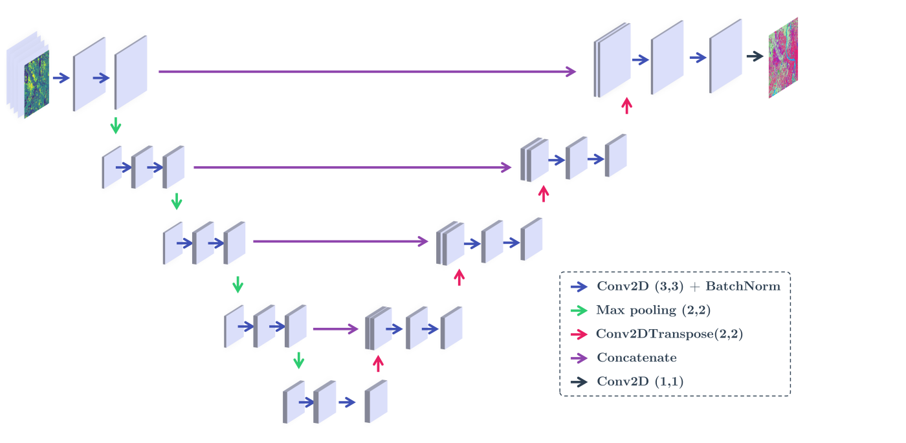

<div align="center">
  <h1>
    Unet to copy paste
  </h1>
</div>

Simple implementation of Unet top copy paste, using Keras and Tensorflow (2.X).
The implementation is offered in two forms : plain file and as a function.

Original paper [U-Net: Convolutional Networks for Biomedical Image Segmentation](https://arxiv.org/abs/1505.04597).



---
## Quick Start

```python
model = build_Unet(input_shape=(128, 128, 3), output_channels=1, depth=4)
model.summary()
```
### Dependencies

* Tensorflow (2.X)

You need Python 3.5 or later.


## Acknowledgements

-   [@tensorflow](https://github.com/tensorflow/tensorflow)
-   [@keras](https://github.com/keras-team/keras)
```
"U-Net: Convolutional Networks for Biomedical Image Segmentation."
Olaf Ronneberger, Philipp Fischer, and Thomas Brox
arXiv preprint arXiv:1505. 04597, 2015.
```

🖐 Thomas FEL, 2020

